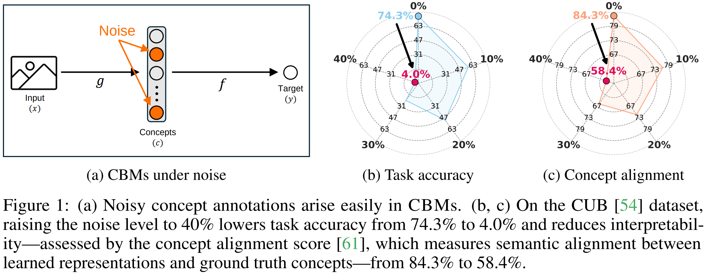

# An Analysis of Concept Bottleneck Models: Measuring, Understanding, and Mitigating the Impact of Noisy Annotations

> Official PyTorch Implementation of [**An Analysis of Concept Bottleneck Models: Measuring, Understanding, and Mitigating the Impact of Noisy Annotations**](https://arxiv.org/abs/2505.16705) (NeurIPS 2025)  
> **Seonghwan Park, Jueun Mun, Donghyun Oh, and Namhoon Lee**


---

## Table of Contents

1. [Abstract](#abstract)
2. [Research Highlights](#research-highlights)
3. [Setup](#setup)
   <!-- - [Clone the Repository](#clone-the-repository)
   - [Create and Activate Conda Environment](#create-and-activate-conda-environment)
   - [Install PyTorch and TorchVision](#install-pytorch-and-torchvision)
   - [Install Dependencies](#install-dependencies) -->
4. [Data Preparation](#data-preparation)
   - [CUB Dataset](#cub-dataset)
   - [AwA2 Dataset](#awa2-dataset)
5. [Running the Experiments](#running-the-experiments)
   - [Independent Model](#independent-model)
   - [Joint Model](#joint-model)
   - [Sequential Model](#sequential-model)
   - [Test-Time Intervention](#test-time-intervention)
6. [Contact](#contact)
7. [Citation](#citation)
8. [Acknowledgements](#acknowledgements)

---

## Abstract

<p align="center">
  
</p>

> Concept bottleneck models (CBMs) ensure interpretability by decomposing predictions into human interpretable concepts.
Yet the annotations used for training CBMs that enable this transparency are often noisy, and the impact of such corruption is not well understood.
In this study, we present the first systematic study of noise in CBMs and show that even moderate corruption simultaneously impairs prediction performance, interpretability, and the intervention effectiveness.
Our analysis identifies a **susceptible** subset of concepts whose accuracy declines far more than the average gap between noisy and clean supervision and whose corruption accounts for most performance loss.
To mitigate this vulnerability we propose a two-stage framework.
During training, sharpness-aware minimization stabilizes the learning of noise-sensitive concepts.
During inference, where clean labels are unavailable, we rank concepts by predictive entropy and correct only the most uncertain ones, using uncertainty as a proxy for susceptibility.
Theoretical analysis and extensive ablations elucidate why sharpness-aware training confers robustness and why uncertainty reliably identifies susceptible concepts, providing a principled basis that preserves both interpretability and resilience in the presence of noise.

## Research Highlights

### Key Contributions

- **Measuring Impact:**  
  We present the first comprehensive and systematic characterization of noise's impact on CBMs, demonstrating that even moderate level of noise significantly degrades predictive performance, interpretability, and intervention effectiveness.

- **Understanding Mechanisms:**  
  To deepen our understanding of noise effects on \cbms, we identify a _susceptible set_, a small subset of concepts that suffer significant accuracy loss, and demonstrate that overall performance decline is largely driven by these localized failures.

- **Mitigating Effects:**  
  To neutralize the risk of the susceptible set, we introduce two mitigation strategies: integrating sharpness minimization during training and implementing an uncertainty-based intervention at inference. Our suggestion is supported by theory and validated through extensive empirical evidence.

---

## Setup

### Clone the Repository
Clone the repository from GitHub and navigate into the directory.
```shell
git clone https://github.com/LOG-postech/CBM-Noise.git
cd CBM-Noise
```

### Create and Activate Conda Environment
Create a new Conda environment named `cbm-noise` with Python version 3.9.12 and activate it.
```shell
conda create -y -n cbm-noise python=3.9.12
conda activate cbm-noise
```

### Install PyTorch and TorchVision

> **Note:** If you require a different CUDA version, please refer to the [PyTorch official website](https://pytorch.org/).

Install specific versions of `torch` and `torchvision` using `pip` with the specified CUDA version.

```shell
pip install torch==1.13.0+cu117 torchvision==0.14.0+cu117 --extra-index-url https://download.pytorch.org/whl/cu117
```

### Install Dependencies

Install all necessary dependencies listed in the `requirements.txt` file.
```shell
pip install -r requirements.txt
```

---

## Data Preparation

### CUB Dataset

Download the CUB dataset from [http://www.vision.caltech.edu/visipedia/CUB-200-2011.html](http://www.vision.caltech.edu/visipedia/CUB-200-2011.html) and place the downloaded data under the `DATA/` directory.

### AwA2 Dataset

Download the AwA2 dataset from [https://cvml.ista.ac.at/AwA2/](https://cvml.ista.ac.at/AwA2/) and place it under the `DATA/` directory.

---

## Running the Experiments

Before running any experiment, set the `FOLDER_DIR` variable in each shell script to your working path.

Each shell script handles the full pipeline including training (X→C and C→Y where applicable) and inference. You can configure the following variables at the top of each script:

| Variable | Options | Description |
|---|---|---|
| `DATASET` | `cub`, `awa2` | Target dataset |
| `OPTIMIZER` | `SGD`, `SAM` | Optimizer (SAM: Sharpness-Aware Minimization) |
| `NOISE` | `0.0`, `0.1`, ... | Noise ratio (`0.0` for clean) |
| `NOISE_LOC` | `concept`, `class`, `both` | Where to inject noise |
| `BACKBONE` | `inception_v3`, `resnet18_cub`, `resnet101`, `vit_b16`, `vit_l16` | Backbone architecture |
| `RHO` | `0.1`, ... | Perturbation radius for SAM |

### Independent Model

Trains the X→C model and C→Y model separately, then runs inference.

```shell
sh train_cbm_ind.sh
```

### Joint Model

Trains the X→C→Y model end-to-end, then runs inference.

```shell
sh train_cbm_joi.sh
```

### Sequential Model

Uses the X→C model from the Independent model, then trains C→Y on the predicted concept logits.

> **Note:** The Sequential model requires a pre-trained Independent X→C model. Run `train_cbm_ind.sh` first.

```shell
sh train_cbm_seq.sh
```

### Test-Time Intervention

Runs test-time intervention (TTI) on a trained Independent model. The intervention criterion can be configured via the `CRITERION` variable (e.g., `ucp`, `rand`, `lcp`, `cctp`, `ectp`, `eudtp`).

```shell
sh tti.sh
```

---

## Contact

For any questions, discussions, or proposals, please contact:

📧 **Email:** [shpark97@postech.ac.kr](mailto:shpark97@postech.ac.kr)

---

## Citation

If you use our code in your research, please consider citing:

```bibtex
@article{park2025analysis,
  title={An Analysis of Concept Bottleneck Models: Measuring, Understanding, and Mitigating the Impact of Noisy Annotations},
  author={Park, Seonghwan and Mun, Jueun and Oh, Donghyun and Lee, Namhoon},
  journal={arXiv preprint arXiv:2505.16705},
  year={2025}
}
```
---

## Acknowledgements

Our experimental pipeline is built upon the following repository:

- [CBM](https://github.com/yewsiang/ConceptBottleneck)  
- [CBM-Intervention](https://github.com/rabeehk/compacter)
- [SAM](https://github.com/google-research/sam)

We express our gratitude to Koh _et al._, Shin _et al._, and Foret _et al._ for sharing their outstanding work and making their contributions available through open-source initiatives.
